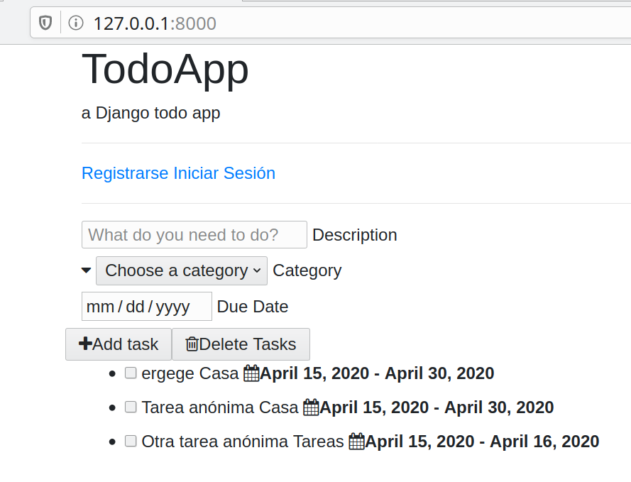
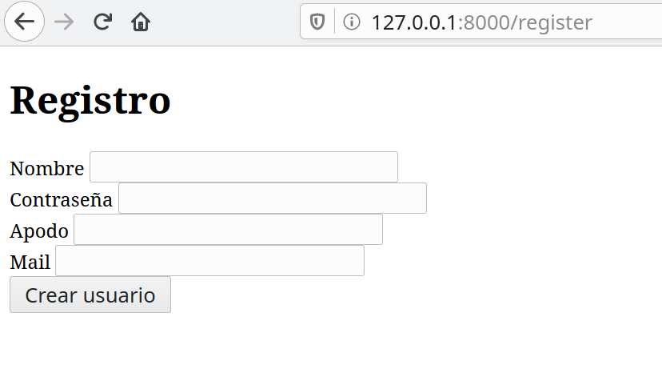
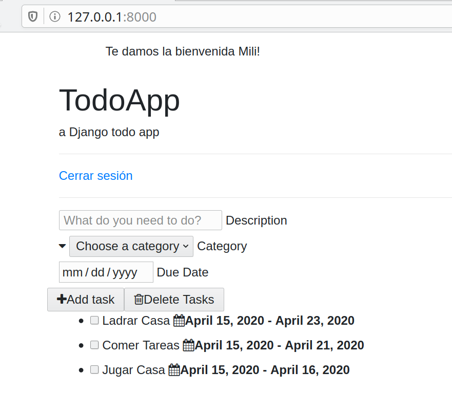
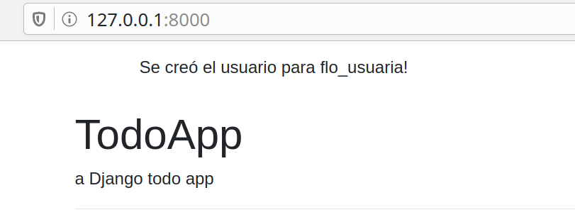

# Auxiliar 3: Django Users
Hoy crearemos un sistema de usuarios para la aplicación de Tareas. Empieza haciendo un Fork de este repositorio y luego clonarlo en tu computador para empezar la actividad. 
>Para ver como hacer Fork de un repositorio y clonarlo a tu computador te recomendamos leer los primeros pasos de la [auxiliar 1](https://github.com/Aux-Ing-1/Auxiliar1-GIT).

>Deben correr el proyecto en un nuevo ambiente virtual utilizando el requirements.txt que tiene este proyecto.

1. `python3 -m venv myvenv` en Linux o `python -m venv myvenv` en Windows para crear el nuevo ambiente virtual.
2. `source myvenv/bin/activate` en Linux o `myvenv\Scripts\activate` en Windows para iniciar el ambiente virtual.
3. `python -m pip install --upgrade pip`
4. `pip install -r requirements.txt`

 
## Librería Auth
Django posee su propio sistema de usuarios, el cual esta incluido en la [librería Auth](https://docs.djangoproject.com/en/3.2/topics/auth/). 
Un usuario está representado por un objeto de la clase User y sus atributos principales son:
* username
* password
* email
* first_name
* last_name

[Aquí](https://docs.djangoproject.com/en/3.2/ref/contrib/auth/#django.contrib.auth.models.User) encuentras todos los atributos de la clase User.

Hoy vamos a agregarle usuarios a nuestra app de Tareas para que cada uno tenga su propia lista de tareas.
Para esto tendremos que __crear usuarios__, __loguearlos__ y __asignarle un usuario a cada tarea__!



## Actividad
### [Parte 0: Borrar la Base de Datos]
Como hoy cambiaremos el modelo de usuarios predeterminado de Django, habrá que comenzar la base de datos desde 0. 
Esto significa eliminar todas las migraciones y la base de datos de sqlite. 

Para esto tendrás que borrar la carpeta `todoapp/migrations`, `categorias/migrations` y el archivo `db.sqlite3`. 
> Esto solo se hará hoy y al inicio de todo, nunca debería haber necesidad de borrar todo y empezar denuevo. 

### [Parte 1: Crear Usuarios]
Para nuestra aplicación queremos que los usuarios tengan Nombre, Contraseña, Apodo, Mail y Pronombre. Un User de Django ya trae algunos de estos atributos, pero no todos. 
Es por esto que vamos a crear nuestra propia clase User que heredará de AbstractUser y así podremos guardar todos los atributos que queramos. 

AbstractUser es una clase que trae toda la funcionalidad de los usuarios de Django y está diseñada para cuando queremos agregar más información a los usuarios. 


1. __Crear modelo User__: 
    
    * En `todoapp/models.py` agregaremos el modelo `User` que heredará de `AbstractUser` y le pondremos los atributos apodo y pronombre para tener más información sobre le usuarie. Al hacer esto vamos a tener acceso a los atributos base de un User de Django y a toda la funcionalidad de autenticación. 

        > Importante! La clase User tiene que ser la primera clase que aparezca en el modelo. 
    
        ```python
        
      from django.contrib.auth.models import AbstractUser
        
      class User(AbstractUser):
          pronombres = [('La','La'),('El','El'), ('Le','Le'),('Otro','Otro')]
          pronombre = models.CharField(max_length=5,choices=pronombres)
          apodo = models.CharField(max_length=30)
            
        ```
      > El pronombre será un CharField pero solo podrá ser alguna de las opciones definidas en la variable pronombres. El primer elemento del par será el valor del atributo, y el segundo elemnto del par será el valor en lenguaje natural. En este caso les llamaremos igual. 
      
    * Antes de hacer las migraciones tenemos que hacer un paso más. 
        Vamos a ir a `TODOproject/settings.py` y agregaremos esta línea: 
    
        `AUTH_USER_MODEL = 'todoapp.User'`
    
        Con esta linea le diremos al proyecto que el sistema de usuarios ahora será en base al modelo User que acabamos de crear. 
    
    *  Luego de agregar este modelo hay que hacer: 
        ```python
       $ python manage.py makemigrations todoapp categorias
       $ python manage.py migrate
        ```
       Con esto los cambios al modelo se reflejan en la base de datos. 
    *  Ahora puedes hacer `python manage.py runserver` para correr la app y al entrar a `127.0.0.1:8000/tareas` deberías ver el form de tareas. 
        > Como en el primer paso borramos todos los datos de la base de datos, ahora no tendrás categorías para agregar tus tareas. 
        > Para arreglar esto, en la carpeta categorías de este repositorio hay un archivo `.json` con catogrías listas para agregar. Guarda este archivo en la carpeta `categorias`. Para usar este archivo tendrás que correr el siguiente comando: 
        
        >`python manage.py loaddata categorias/categorias.json` 
    
2. __Formulario de registro de usuarios__:
    
    Para crear un nuevo usuario crearemos una nueva URL que será `/register`. 
    Al entrar a esta URL habrá un formulario que, luego de llenarlo correctamente, creará un nuevo `User` y nos llevará a la página de inicio de la app. 
    
    2.1 __URLs__
     
     Primero crearemos la URL en `todoapp/urls.py`, agregando la siguiente línea: 
     
     ```python
   path('register', views.register_user, name='register_user'), 
    ``` 
   
   2.2 __Views__

    Luego tenemos que hacer la view `register_user` para mostrar el formulario. Para eso colocamos el siguiente código en `todoapp/views.py`:
  
    ```python
   def register_user(request):
       return render(request,"todoapp/register_user.html")
    ```
   >Fíjate que en views creamos el método `register_user` porque en `urls.py` dijimos que `/register` estaría asociado a este método. 
   
   2.3 __Templates__
   
   Finalmente tenemos que crear el formulario para registrar al usuario. 
   Este lo guardaremos en `templates/todoapp/register_user.html` y llevará lo siguiente: 
   ```
        <!DOCTYPE html>
        <html lang="en">
        <head>
           <meta charset="UTF-8">
           <title>Registro</title>
        </head>
        <body>
           <h1> Registro </h1>
           <form method="post">
               
               <div class="form-group">
                   <label for="nombre_usuario">Nombre</label>
                   <input type="text" class="form-control" id=nombre_usuario name="nombre" required>
               </div>

               <div class="form-group">
                   <label for="contraseña">Contraseña</label>
                   <input type="password" class="form-control" id="contraseña" name="contraseña" required>
               </div>

                <div class="form-group">
                   <label for="apodo">Apodo</label>
                   <input type="text" class="form-control" id="apodo" name="apodo" required>
                </div>

               <div>
                   <label for="pronombre">Pronombre</label>
                   <select id="pronombre" class="form-control" name="pronombre" required>
                       <option class="disabled" value="">Elige un pronombre</option>
                       <option value="El">El</option>
                       <option value="La">La</option>
                       <option value="Le">Le</option>
                       <option value="Otro">Otro</option>
                   </select>
               </div>

                <div class="form-group">
                    <label for="mail">Mail</label>
                    <input type="email" class="form-control" id="mail" name="mail" required>
                </div>
                <button type="submit">Crear usuario</button>
           </form>
        </body>
        </html>
    ```

    __¿Qué hay en este código HTML?__ 
    
    Lo mas importante por ahora es el formulario que se crea con la etiqueta ```<form>```. 
    Todo lo que está dentro de form serán los campos que tendremos que llenar para crear un usuario. 
    Cada "campo" está formado por un ```<label>``` y un ```<input>``` (este último es donde ingresamos los datos). 
    Es importante que para la contraseña el input tenga type `password` y que para el correo tenga type `email`. 
    
    * Ahora si hacemos ```python manage.py runserver``` e ingresamos a `127.0.0.1:8000/register` deberíamos ver el formulario de registro. 
   
   
   
   > ¿Qué pasa si intentamos crear un usuario? Nada, porque no le hemos dado instrucciones a la app para registrar el usuario. 
   
3. __Guardar datos del formulario__:
   
   Cuando creamos el método `register_user` solo le indicamos que hiciera render del formulario. 
   Ahora queremos diferenciar entre una llamada GET (cuando cargamos la página) y una llamada POST (cuando enviamos un formulario).
   
   Para esto vamos a editar `todoapp/views.py` y diferenciar estos dos casos: 
   ```python
   from django.http import HttpResponseRedirect
   def register_user(request):
       if request.method == 'GET': #Si estamos cargando la página
        return render(request, "todoapp/register_user.html") #Mostrar el template

       elif request.method == 'POST': #Si estamos recibiendo el form de registro
        #Tomar los elementos del formulario que vienen en request.POST
        nombre = request.POST['nombre']
        contraseña = request.POST['contraseña']
        apodo = request.POST['apodo']
        pronombre = request.POST['pronombre']
        mail = request.POST['mail']

        #Crear el nuevo usuario
        user = User.objects.create_user(username=nombre, password=contraseña, email=mail, apodo=apodo, pronombre=pronombre)

        #Redireccionar la página /tareas
        return HttpResponseRedirect('/tareas')
   ```
    
   ```python
   #Estos son los imports que van al inicio de views.py
   from todoapp.models import User       
    ```
   
   En el código anterior, cuando el método es POST estamos haciendo lo siguiente: 
   * recuperamos los datos que vienen del formulario.
   * creamos un User con estos datos.
   * redirigimos a la página de inicio. 
   
   
   > Atención: En el formulario de registro le pusimos un _name_ a cada ```<input>``` y con ese name podemos acceder a los datos en ```request.POST```.
   
 4. __Prueba que el formulario esté funcionando__ y agrega cuentas. 
       
       Para comprobar que se crearon puedes hacer lo siguiente: 
       * Editar `todoapp/admin.py` y agregar 
       ```
        from todoapp.models import User, Tarea
        from categorias.models import Categoria
        
        admin.site.register(Categoria)
        admin.site.register(User)
        admin.site.register(Tarea)
    ```
       
       * Crea un superusuario haciendo ```python manage.py createsuperuser```. 
       
       * Luego ingresa a 127.0.0.1:8000/admin y deberías poder ver todos los Users que has creado! 
       

 
### [Parte 2: Login y Logout]
Un **login** es un formulario donde los usuarios inician sesión.
Mientras que **logout** es un botón o link por el cual los usuarios cierran sesión.
Es importante que el login solo sea visible cuando los usuarios no han iniciado sesión y, en caso de que ya se haya iniciado sesión, debe haber un link para cerrar sesión (logout).

Como el modelo User que implementamos hereda de AbstractUser, la autenticación será muy fácil de implementar en nuestro proyecto. 
De hecho, antes de implementar cualquier cosa, nuestro proyecto ya tiene una variable `user` en los templates y en views tenemos `request.user`. 

> ¿Cómo saber si una sesión está activa? 
> 
>En la views : _if request.user.is_authenticated():_
>
>En los templates:  __

    
Lo que haremos ahora es mostrar la opción de hacer login o registrarse, si no hay un usuario logueado. Si hay un usuario logueado mostraremos un botón de logout. 

                    

1. __Crear botones de login - logout__: 

    En index.html vamos a crear botones para hacer login o logout según lo que se necesite. En un principio los botones no harán nada,
    y les iremos dando funcionalidad a medida que avanzamos. 
    
    Agrega el siguiente código justo antes de la línea donde comienza el form (`<form>`):
    
    index.html: 
    ```html
    <hr>
    
       <a href="">Cerrar sesión</a>
    
       <a href="">Registrarse</a>
       <a href="">Iniciar Sesión</a>
    
    <hr>
    ```  
    En el código anterior estamos revisando si el usuario que está viendo la página ya hizo login y, si lo hizo, entonces le mostramos la opción de logout. 
    En cambio, si no ha hecho login, le daremos la opción de hacer login o registrarse. 
    La opción de registrarse ya tiene un `href` porque ya implementamos el registro de usuarios en el paso anterior. 

2. __Login__:

    Para hacer login tendremos una URL especial para esto (`/login`). El formulario de login será igual que los que creamos antes, pero solo pediremos nombre y contraseña. 
    
    Para esto crearemos un formulario donde se inicia sesión, la URL de login, y la view que nos permitirá hacer el login:
    
    2.1 __URLs__: Crear la URL _/login_ que cargará el método `login_user` en las views.  
    ```python
   path('login',views.login_user, name='login'),
    ```     
   
   2.2 __Views__: Creamos el método `login_user` que hará render del formulario de login. 
   ```python
   def login_user(request):
       if request.method == 'GET':
           return render(request,"todoapp/login.html")  
   ```
   
   2.3 __Templates__: Creamos el HTML del formulario, que tendrá nombre y contraseña. 
   Para esto creamos un archivo `login.html` en la carpeta `todoapp/templates/todoapp`. 
   
   Hay que poner atención a lo que hay dentro de ```<form>``` porque ahí están los campos donde se piden los datos. 
   ```html
        <!DOCTYPE html>
        <html lang="en">
        <head>
            <meta charset="UTF-8">
            <title>Login</title>
        </head>
        <body>
            <div class="container">
                <div class="content">
                    <h1> Iniciar Sesión </h1>
                    <form method="post" >
                        
                        <div class="form-group">
                            <label for="nombre_usuario">Nombre</label>
                            <input type="text" class="form-control" id=nombre_usuario name="username" required>
                        </div>
                        <div class="form-group">
                            <label for="contraseña">Contraseña</label>
                            <input type="password" class="form-control" id="contraseña" name="contraseña" required>
                        </div>
                        <button type="submit">Entrar</button>
                    </form>
                </div>
            </div>
        </body>
        </html>
    ```
   
   Igual que antes, si ingresamos a `127.0.0.1:8000/login` veremos el formulario de login donde se pide el nombre y la contraseña.
   
   Si enviamos el formulario (apretamos el botón) debería aparecer un error porque aun no le indicamos a la app qué hacer cuando enviamos el formulario. 
   
   Para arreglar esto tenemos que editar `views.py` para que inicie sesión cuando el método sea POST, como se muestra en el paso siguiente. 
   
   2.4 __Autenticar y loguear el usuario__: 
   
   A continuación está el código que nos permitirá autenticar y loguear al usuario. Este código hace lo siguiente: 
   * Cuando se recibe el formulario, se guarda en variables el nombre y la contraseña que ingresó el usuario.
   * Luego usaremos el método ```authenticate(user, password)``` que nos permitirá buscar el usuario con esas credenciales. 
   * Si authenticate no entrega None, significa que el usuario si existe y podemos hacer ```login()```. 
   * Si el usuario fuera None, significa que no existe un usuario con esas credenciales y se redirige a la vista de registro. 
   
   views.py 
   ```python
   from django.contrib.auth import authenticate, login,logout
   def login_user(request):
       if request.method == 'GET':
           return render(request,"todoapp/login.html")
       if request.method == 'POST':
           username = request.POST['username']
           contraseña = request.POST['contraseña']
           usuario = authenticate(username=username,password=contraseña)
           if usuario is not None:
               login(request,usuario)
               return HttpResponseRedirect('/tareas')
           else:
               return HttpResponseRedirect('/register')
   ```
   
   2.5 Antes de terminar con el login nos falta darle funcionalidad al botón de login que creamos en `index.html`. 
   Para esto hay que modificar la siguiente línea del archivo:
   ```html
   <a href="">Iniciar Sesión</a>
   ``` 
   Con eso hacemos que al apretar el vínculo que dice "Iniciar Sesión", nos redirigirá a la URL que tiene nombre 'login'. 
         
3. __Logout__: 

    Para hacer logout no tendremos que llenar ningún formulario, sino que solo apretar el link y cerrar la sesión. 
    Para lograr esto crearemos una URL y una view que hará logout y luego redirigirá a la página de inicio. 
    
    3.1 __URLs__:
    Creamos la URL `/logout` que cargará el método `logout_user` en las views y tiene como nombre 'logout'. 
     ```python
   path('logout',views.logout_user, name='logout'),
    ```
   
   3.2 __Views__:
   Como nuestros usuarios son usuarios de Django, hacer logout es igual de sencillo que hacer login. 
   Solo tendremos que llamar al método logout() y ya se habrá cerrado la sesión del usuario. 
   
   Para esto, en `todoapp/views.py` hay que agregar el método `logout_user`: 
   ```python
    
   def logout_user(request):
       logout(request)
       return HttpResponseRedirect('/tareas')
   ```
    3.3 __Templates__: 
    Antes solo creamos el vínculo que serviría para cerrar sesión, pero no lo vinculamos con ninguna URL. 
    Ahora que creamos la URL para logout, podremos agregarla a nuestro template `index.html` modificando la siguiente línea: 
    ```html
   <a href="">Cerrar sesión </a>
   ```
   Al igual que con login, cuando agregamos el código `` a `href`, le estamos diciendo que busque una URL con el nombre 'logout'. 
   En este caso llamará a _/logout_. 
   
### [Parte 3: Cada Usuario tendrá sus Tareas]
Para terminar, queremos que un usuario que está logueado solo vea las Tareas que fueron creadas por él. 
Para esto tendremos los siguientes requisitos: 
* Una Tarea creada por un usuario anónimo, solo se mostrará cuando el usuario sea anónimo. 
* Una Tarea creada por un usuario logueado, solo se mostrará cuando ese usuario esté logueado.
* Un usuario logueado solo verá las Tareas creadas por él. 

Para asociar una Tarea a un usuario tendremos que modificar nuestro modelo Tarea y agregarle una llave foránea.

Luego tendremos que modificar la view donde se crean las Tareas para asociarla a un usuario, en el caso que exista un usuario logueado. 

Finalmente vamos a modificar la view donde se cargan las Tareas para mostrar solamente las Tareas que corresponden a ese usuario. 

1. __Modificar el modelo Tarea__: 

    Vamos a agregar un atributo a Tarea que se llamará "owner". 
    Este atributo será una llave foránea a User y podrá ser nula. 
    En la clase Tarea de `todoapp/models.py` agregamos el siguiente atributo: 

     ```python
   owner = models.ForeignKey(User,blank=True,null=True, on_delete=models.CASCADE)
    ```
    > Importante! Luego de modificar este modelo hay que hacer 
    >```python
    >$ python manage.py makemigrations todoapp
    >$ python manage.py migrate
    >```
    >para que los cambios en el modelo se reflejen en la base de datos. 

       
2. __Modificar la creación de Tareas en views.py__: 

    En el método `tareas()` de views.py es donde se crean las nuevas Tareas, 
    por lo tanto modificaremos este método para asociar la nueva Tarea a un usuario que esté logueado. 
    
    Para eso en el método `tareas` de `todoapp/views.py` habrá que revisar si el `request.user` está autenticado. 
    El siguiente código muestra como debería quedar esta parte del código. Modifica tu `views.py` para que quede como este: 
    
    ```python
       if request.method == "POST":  # revisar si el método de la request es POST
        if "taskAdd" in request.POST:  # verificar si la request es para agregar una tarea (esto está definido en el button)
            titulo = request.POST["titulo"]  # titulo de la tarea
            nombre_categoria = request.POST["selector_categoria"]  # nombre de la categoria
            categoria = Categoria.objects.get(nombre=nombre_categoria)  # buscar la categoría en la base de datos
            contenido = request.POST["contenido"]  # contenido de la tarea
   
            #Verificar si el usuario inició sesión o no!!
            if request.user.is_authenticated:
                nueva_tarea = Tarea(titulo=titulo, contenido=contenido, categoria=categoria,owner=request.user)  # Crear la tarea
            else:
                nueva_tarea = Tarea(titulo=titulo, contenido=contenido, categoria=categoria)
            nueva_tarea.save()  # guardar la tarea en la base de datos.
            return redirect("/tareas")  # recargar la página.
   ```

   En esta variación lo que estamos haciendo es verificar si el usuario está autenticado. 
   Si está autenticado entonces se agregará el atributo "owner". 
   Si no está autenticado, se dejará vacío. 

3. __Modificar la carga de Tareas en views.py__: 

    En el método `tareas()` de views.py creamos la variable `mis_tareas` que tomará todas las Tareas que luego mostraremos en el template. 
    Ahora, no queremos mostrar todas las Tareas sino que sólo las que pertenezcan al usuario. 
    
    Para esto tendremos que cambiar la _query_ que haremos para cargar las Tareas. En el método `tareas` de `todoapp/views.py` hay que agregar esta condición al crear la variable `mis_tareas` :
    
    ```python
   if request.user.is_authenticated:
       mis_tareas = Tarea.objects.filter(owner=request.user)# quering all todos with the object manager
   else:
       mis_tareas = Tarea.objects.filter(owner=None)
   ```
   
   En esta variación estamos revisando si el usuario inició sesión o no, con user.is_autenticated.
   Si el usuario inició sesión, entonces se filtrarán las Tareas tal que el owner sea ese usuario. 
   En caso contrario, se buscarán las Tareas tal que el owner sea None.


### Conclusiones
Si iniciamos sesión solo veremos las Tareas que se crearon con nuestro usuario. En caso contrario veremos las Tareas que agregamos antes de iniciar sesión. 
   
   
Si no iniciamos sesión, solo veremos Tareas que se crearon anónimamente. 
    

> Gracias a esta implementación de usuarios, la autenticación es muy fácil y muy parecida en todas las apps de Django.

> Es importante usar implementaciones de autenticación que vengan pre-hechas ya que así disminuye la posibilidad de tener problemas de seguridad. 
> Si se fijaron nunca tuvimos que preocuparnos de guardar contraseñas de forma segura porque eso lo hace la librería Auth. 

> La app se ve en blanco y negro y sin estilo porque no hemos hecho nada relacionado con CSS. Más adelante vamos a ver cómo funciona CSS y cómo dejar bonitas sus apps. 


>
> La base de este código fue sacada de [este tutorial](https://medium.com/fbdevclagos/how-to-build-a-todo-app-with-django-17afdc4a8f8c).


### [Bonus] Agregar un mensaje al crear el usuario. 
 
Existe una librería en Django que nos permite crear mensajes o alertas ([mas info](https://docs.djangoproject.com/en/3.0/ref/contrib/messages/)) cuando terminamos de procesar alguna información. 

Gracias a esto cuando procesamos un formulario podemos enviar un mensaje a la siguiente página que mostramos. 

Queremos ver un mensaje así luego de crear un usuario: 
 

 __¿Cómo hacemos esto?__
 * Importar messages de django.contrib en `views.py`.
 * Agregar el mensaje después de crear el usuario. 
 * Mostrar el mensaje en el template.
 
 El final del método `register_user` de `views.py` debería quedar así: 
 ```
    from django.contrib import messages
    ....
    elif request.method == 'POST':
        ...
        ...
        user = User.objects.create_user(username=nombre, password=contraseña,email=mail)
        messages.success(request, 'Se creó el usuario para ' + user.apodo)
        return HttpResponseRedirect('/tareas')
 ```
Aquí estamos agregando un nuevo mensaje de tipo success que dirá "Se creó el usuario para _apodo_".  
Y en index.html agregamos el siguiente código para mostrar el mensaje al inicio de la página (fíjense que se agrega solo el if): 
```html
   <!-- Encabezado de la página-->
        
            <ul class="messages">
                
                     <div class="alert">
                      {{message}}
                    </div>
                
            </ul>
        
        <h1>TodoApp</h1>
``` 
Esto revisará si hay mensajes y por cada mensaje que haya lo mostrará en el template. 


__[Desafío]__ 

   Qué pasa si ahora queremos mostrar un mensaje después de hacer login? 
   Intenta hacer que se vea esto al inicio de la página después de iniciar sesión: 
   
    
